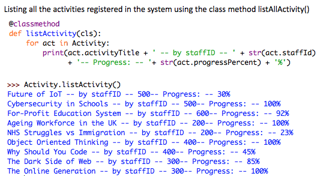

# Academia: A super simple app
A single page application to manage academic works of teaching staff. 
## Client Requirements
ABC College's senior management team decided to develop a system for maintaining staff’s scholarly activities.  
The new system will be maintaining the following records:
- Staff name 
- department
- job title
- contract type (full/part time)
- date joined ABC
- scholarly activity
- date of the activity etc. 
(you are free to make logical assumptions and justify them).  
The staff will be able to input the above records and update their progress on scholarly activities.  
The system will mainly be used by the Vice-Principal of Research & Enterprise.  
He should be able to track whether staff (investigators) received the requested resources to conduct their 
activities and progress on the activities.
## Class Diagram

## Usage
If you are not sure how to execute the python file, have a look at this [guide](https://realpython.com/run-python-scripts/)
OR, simply open up the file using IDLE then Run > Run Module. Some examples of execution are shown below: 

Please feel free to use the code as you like.  
Let me know if you find errors or a better way(there always is).   
Share if someone needs it.  
